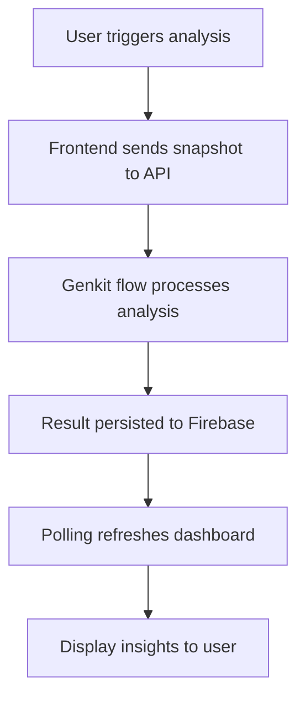

# AI-Powered Insight Integration Explanation

## What is AI-Powered Insight Integration
The AI-Powered Insight Integration is a new feature set that enables real-time analysis of personal financial data using Genkit. It allows users to gain deeper understanding of their spending patterns and receive personalized recommendations by leveraging LLMs within the "Foot Print of Money" application.

## Why This Integration is Needed
- **Spending Pattern Insight**: Users often struggle to identify where their money goes. AI analysis provides a clear, categorized view.
- **Personalized Recommendations**: Generic financial advice doesn't account for individual habits. Our AI offers actionable, habit-based suggestions.
- **Real-time Feedback**: Manual tracking is often delayed. AI-powered insights provide immediate feedback, encouraging better financial habits.

## How It Works
The integration bridges the frontend application, a Node.js-based AI service, and a managed database.

### Core Mechanisms
1. **Genkit Analysis**: The application sends transaction and budget snapshots to the Genkit `analyzeExpenses` flow, which uses a large language model to derive insights and recommendations.
2. **Persistence**: Insights are securely stored in the Firebase AI Studio database (`ai-studio-19d62b16-ab1c-4508-9f82-a97bbc9a8310`), allowing for historical review and tracking.
3. **Reactive UI**: The dashboard uses a polling mechanism to refresh insights every 60 seconds, ensuring the UI reflects the latest financial status.

### Workflow

## Related Concepts
- **Genkit**: The core framework used to build the AI flow and integrate the LLM.
- **Firestore**: The underlying real-time database used for persisting financial data and AI insights.
- **RLS (Row Level Security)**: Used in Supabase to ensure users only access their own data.

## Practical Applications
### Application Scenario: Daily Financial Review
- **Background**: Users need to see their spending status at the end of the day.
- **Application**: The user clicks the "Get Insight" button, and the AI analyzes the day's transactions.
- **Effect**: The user gets a quick summary of their spending behavior, helping them adjust for the next day.

## Best Practices
- **Privacy First**: Always strip personal information from snapshots before sending them to the AI service.
- **Polling Efficiency**: Ensure polling intervals are set appropriately to prevent unnecessary load on the backend.
- **Error Handling**: Provide clear user feedback if the AI service fails to generate an insight.

## Common Misconceptions
**Misconception 1**: The AI accesses live bank feeds.
**Correct Understanding**: The AI currently analyzes snapshots provided by the user via the frontend app, ensuring users retain full control over their financial data.

**Misconception 2**: AI insights are always 100% accurate financial advice.
**Correct Understanding**: AI insights are generated to support the user's financial journey; they should be treated as guidance rather than professional financial advice.

## Further Learning
- [Genkit Documentation](https://firebase.google.com/docs/genkit)
- [Managing Firestore Security Rules](https://firebase.google.com/docs/firestore/security/get-started)
- [Financial Data Privacy Best Practices](https://www.consumerfinance.gov/)
